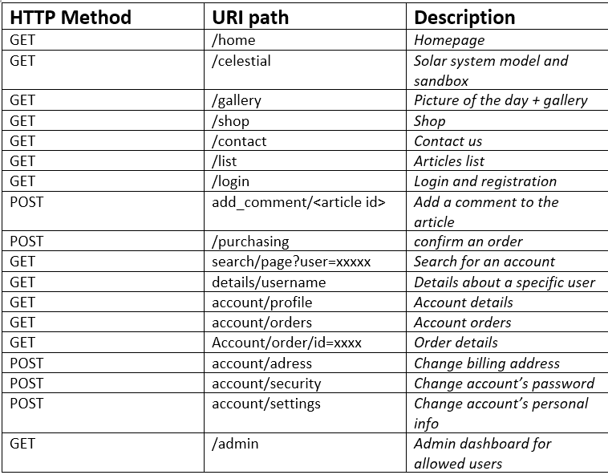
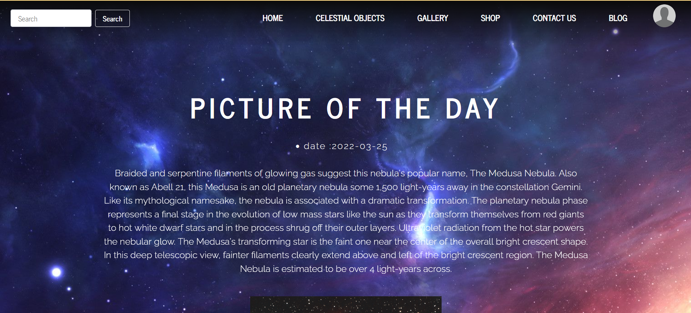
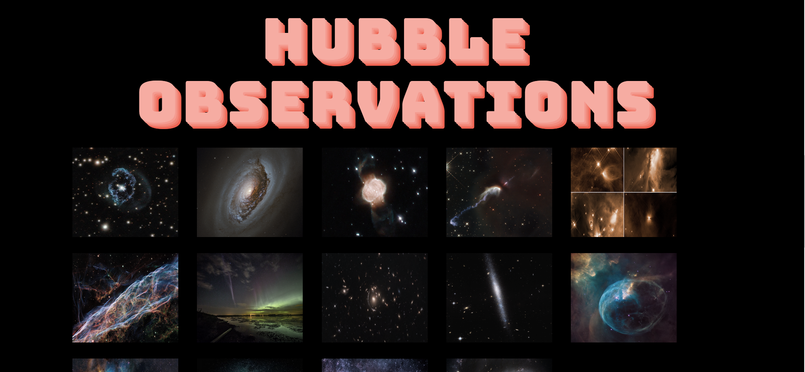
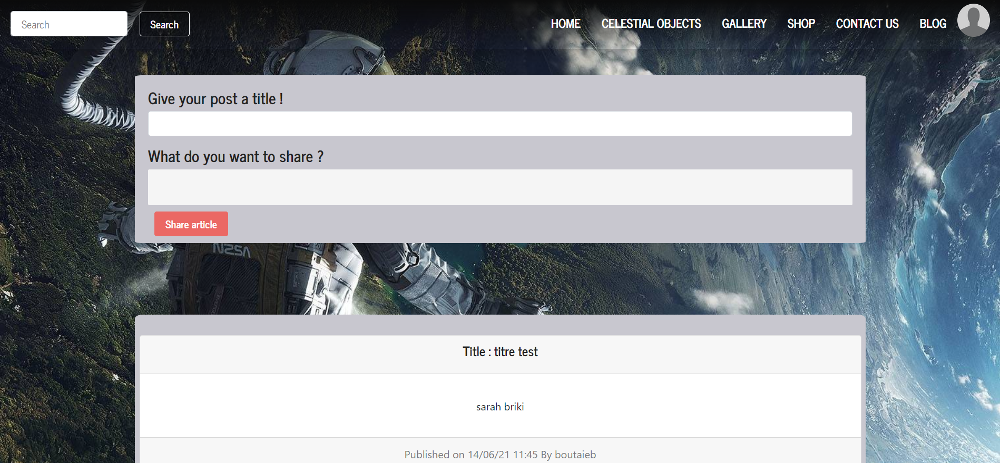
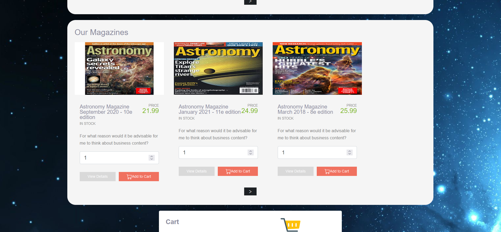
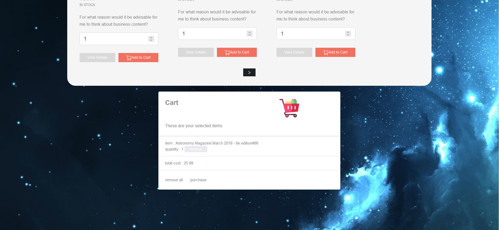
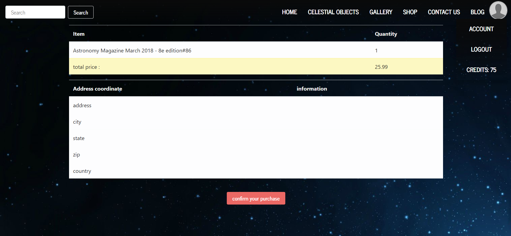
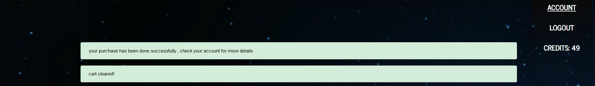
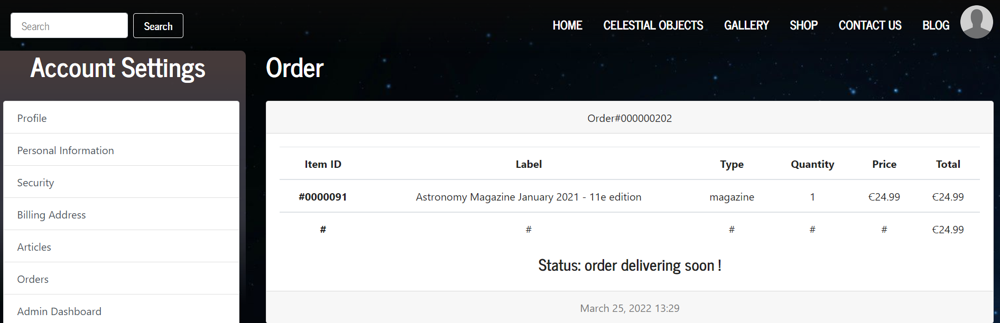

<h1>Contributors to this project :</h1> Briki Sara, Boutaieb Mohamed, Khayati Med Aziz, Bouhamed Feriel

<h1><a href="http://astronomy-magazine.herokuapp.com/home">Astronomy magazine</a></h1>
<h1>Description:</h1> This is a website about an astronomy magazine , where you can purchase products , publish and read articles , create an account, or simply check our gallery and our beautiful solar system animation.

<h1>Technologies used : </h1>Symfony 
                     PHP
                     CSS
                     HTML.TWIG
                     MYSQL    
                     PostgreSQL    
                     JavaScript 

<h2><a href="https://docs.google.com/presentation/d/1j5haIVt-PIDhRt1g5J7X-35RLk-Dv9bR/edit?usp=sharing&ouid=111443578575065911175&rtpof=true&sd=true"> Site presentation </a> </h2>
<h2><a href="https://drive.google.com/file/d/1kaWbTtDStZtNFZJgSZehADMeh8HufHPC/view?usp=sharing">  Demonstration of the website </a></h2>
<h2>Exposed Endpoints Description</h2>
</img>
<h2> Demonstration </h2>
<h3> Gallery </h3>
</img>
</img>
<h3> blog </h3>
</img>
<h3> Shop </h3>
products:
</img>
cart:
</img>
product purchase :
</img>
when the purchace is confirmed , the price is reduced from the account , and the card is cleared :
</img>
you can check the order detail in you account information:
</img>

